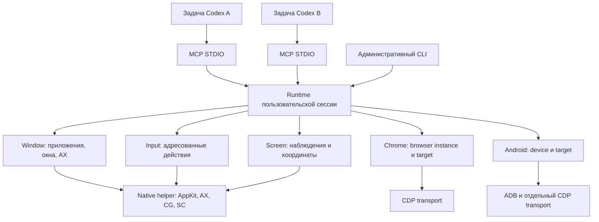
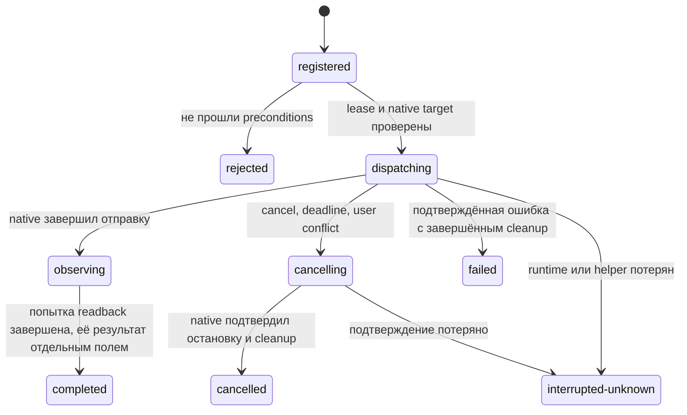

# Проект архитектуры ai-macos для computer use

Дата: 15 сентября 2026. Основание: ревью `bc4b6af`.

**Статус: проект по поручению Владимира. Описанное целевое поведение ещё не реализовано.**
Текущее состояние, воспроизведения и дефекты находятся в
[отчёте ревью](reviews/2026-09-15-computer-use.md), этапы перехода и критерии
приёмки — в [плане поставки](computer-use-delivery.md).

## 1. Что считается полноценным computer use

Агент должен замкнуть цикл: найти приложение и существующее окно → установить
его состояние → при необходимости показать именно это окно → получить снимок
и доступную семантику → выполнить адресованное действие → узнать состояние
отправки → проверить результат → безопасно продолжить или остановиться.

Это включает скрытые и свёрнутые окна, системные диалоги, меню, несколько
мониторов, несколько профилей браузера, потерю связи и параллельные задачи.
Обычный человек может пользоваться тем же Mac; система не требует неподвижного
рабочего стола между вызовами.

Целевой проверяемый профиль — **macOS 13.7.8, Intel x86_64**. Другие версии macOS
и архитектуры получают отдельное подтверждение, а не автоматически наследуют
статус этого профиля. Встроенные Codex Computer Use и AppShot не являются
зависимостью или резервным способом исполнения на этом Mac.

Полнота означает закрытые сценарии и явные ограничения. Она не означает обход
TCC, Secure Input, защищённых изображений или управление произвольным Space
через недокументированные API. Недоступная возможность имеет точную причину;
пустой массив, `ok: true` или разрешение на другой механизм её не заменяют.

## 2. Основное решение: один runtime на пользовательскую сессию

Разделение пакетов сохраняется, но независимые HTTP-сервисы перестают владеть
общим фокусом и вводом. Единственный долгоживущий `@meta/runtime` координирует
ресурсы Mac. Каждый MCP-клиент подключается к нему как отдельная сессия.



Внутренние вызовы модулей идут через типизированные интерфейсы. Между MCP и
runtime — приватный Unix domain socket в каталоге пользователя. Каталог имеет
режим `0700`, socket — `0600`; handshake связывает клиента с текущей сессией,
версией протокола и выданным runtime session token. Это локальная граница
доступа, не защита от уже скомпрометированного процесса того же пользователя.

### Владельцы

| Владелец | Ответственность | Что переезжает или исключается |
| --- | --- | --- |
| `@meta/shared` | Чистые схемы, идентификаторы, ошибки, преобразования координат | OS-вызовы и AppleScript уходят к владельцам; здесь нет I/O |
| `@meta/native` — новый пакет | Подписанный helper, AppKit/AX/CoreGraphics/ScreenCaptureKit, observer, реестр живых AX-объектов, отмена и освобождение ввода | Helper переезжает логически из `input`; физический TCC-путь сохраняется на этапе миграции |
| `@meta/runtime` — новый пакет | Сессии, состояние установки, операции, leases, наблюдения, health, журнал, update lifecycle | Владелец общей координации вместо локальных mutex в MCP |
| `@meta/window` | Инвентаризация приложений/окон/поверхностей, адресация, show/focus/bounds, AX-дерево | Больше не вызывает `@meta/input` через HTTP |
| `@meta/input` | Схемы действий, лимиты, текст/клавиши/pointer/scroll/drag, clipboard | Не владеет inventory и не принимает неадресованный глобальный ввод |
| `@meta/screen` | Снимки, источники кадра, масштаб, области, freshness и occlusion | Не восстанавливает фокус самостоятельно и не проксирует Chrome |
| `@meta/chrome` | Явные browser instances, CDP targets, навигация, DOM/AX, console, viewport/capture | Никакого выбора профиля по совпавшему URL и неявного AppleScript fallback |
| `@meta/android` | Явный serial устройства, собственный ADB forward и CDP instance | Не запускается и не устанавливает зависимости из desktop health |
| `@meta/mcp` | Схемы инструментов, преобразование результатов, доставка изображений и cancellation | Не владеет OS-фокусом, процессами сервисов, низкоуровневым вводом |

Два новых пакета нужны для двух разных времён жизни: общий runtime переживает
переподключения MCP, native helper удерживает AX-ссылки и состояние ввода.
Остальные пакеты остаются предметными модулями, а не отдельными daemon-процессами.

Внутри native helper control/event loop отделён от очереди исполнения. Registry
изменяется последовательно; callbacks публикуют immutable snapshots. Долгий AX
вызов имеет messaging timeout, capture использует async callbacks и не блокирует
приём cancel/heartbeat. Watchdog не зависит от завершения текущего action callback.
Если сам helper перестал отвечать, это потеря native generation и quarantine,
а не повод запускать второго исполнителя рядом с первым.

## 3. Идентичность и инвентаризация

### Идентификаторы

- `runtimeEpoch` меняется после перезапуска runtime или смены login session.
- `clientSessionId` обозначает подключение MCP; authenticated resumption связывает
  переподключение с прежним клиентом и его операциями, не продлевая старый lease.
- `nativeGeneration` меняется при каждом старте helper. Смена helper инвалидирует
  все native refs, даже если runtime остался тем же.
- `applicationRef` связывает PID с экземпляром процесса: launch time и nonce
  регистрации. PID без экземпляра процесса недостаточен после его повторного использования.
- `windowRef` — непрозрачная ссылка runtime на конкретный живой AX-объект и его
  экземпляр. Не вычисляется из заголовка, индекса или геометрии.
- `cgWindowId` — наблюдаемый CGWindowID; поле может отсутствовать. Если пользователь
  передал `pid + windowId` (`windowId` — совместимое имя поля `cgWindowId`),
  разрешён только точный compositor target этого PID из свежего `inventoryId`
  текущих runtime/native generations; selector сразу переводится в live windowRef.
  Отсутствие/неоднозначность соответствия AX приводит к отказу, без поиска похожего окна.
- `surfaceRef` обозначает sheet, popup, menu или другую дочернюю поверхность.
  `ownerWindowRef` задаётся только по подтверждённой связи, а не по вложенности прямоугольников.
- `elementRef` принадлежит ограниченному AX snapshot и истекает при разрушении
  элемента, смене процесса/runtime или несовместимом обновлении дерева.
- `browserInstanceRef + targetId` и `deviceRef + browserInstanceRef + targetId`
  образуют отдельные пространства идентификаторов. CDP window ID не является CGWindowID.

Native registry удерживает AX-ссылки внутри процесса. Notifications помогают
отслеживать изменения; периодический resync и повторная проверка перед действием
обязательны, поскольку приложения могут отдавать неполный AX-набор.
Если AX-ссылка стала недействительной, она истекает. Новый AX-объект не наследует
её windowRef только из-за совпадения frame/title/CG ID. Корреляция CG↔AX через
публичные наблюдения не является документированным прямым bridge: её источник
и степень подтверждения сохраняются отдельно от точного выбора CG target.
Каждому AX-вызову задаётся messaging timeout. `cannotComplete`, `invalidUIElement`
и отказ доступа — разные причины, а не общий ответ «окна нет».

### Полный список и состояние

`list_applications` перечисляет приложения независимо от наличия видимых окон.
`list_windows` по умолчанию возвращает все обнаруженные пользовательские окна;
`scope: visible` является явным фильтром. Используются NSWorkspace, AXWindows и
CG inventory с `optionAll`; потерянные при сопоставлении записи сохраняются с
`actionability: unavailable` и причиной. Apple различает all и onscreen inventory
в [описании optionAll](https://developer.apple.com/documentation/coregraphics/cgwindowlistoption/optionall).

Результат содержит `inventoryId`, время, `complete`, ошибки отдельных приложений,
применённые фильтры и раздельные поля состояния:

| Поле | Значения и смысл |
| --- | --- |
| `applicationHidden` | `true / false / unknown`, свойство приложения |
| `minimized` | `true / false / unknown`, свойство окна из AX |
| `onScreen` | `true / false / unknown`, присутствие в текущей compositor scene |
| `spaceVisibility` | `current / not-current / unknown`; не содержит выдуманного номера Space |
| `occlusion` | `clear / partial / full / unknown` с evidence/source/confidence; default unknown, пересечения bounds недостаточно |
| `fullscreen` | `true / false / unknown` |
| `focused`, `main` | Отдельные наблюдаемые признаки |
| `displayRefs`, `frame` | Логическая геометрия; допускаются отрицательные координаты и несколько дисплеев |
| `mapping` | `corroborated / ambiguous / unavailable`, с источником доказательства связи CG↔AX |
| `actions` | Объявленные AX actions/settable attributes и отдельно проверенный результат выполнения |

`not-current` допустим только при достаточном наблюдении; один `onScreen: false`
не доказывает другой Space. Если приложение есть, но AX-запрос не завершён,
`complete: false` не позволяет заключить, что окон нет. Если CG-сведения
доступны без AX, их можно показать пользователю, но нельзя автоматически
разрешать адресованный ввод по приблизительному соответствию.
При этом живой подтверждённый AX-ref может поддерживать AX show/action даже без
CG ID; capture и координатный ввод имеют отдельные preconditions.

### Показ существующего окна

`show_window(windowRef)` или exact selector `pid + windowId`:

1. Проверить экземпляр процесса, live ref, lease и доступность нужных действий.
2. При hidden — запросить unhide конкретного запущенного приложения; это не launch.
3. При minimized — изменить `AXMinimized` только выбранного окна, если атрибут settable.
4. Запросить focus/raise именно найденного AX-объекта.
5. Дождаться ограниченного readback: то же окно/его принадлежащий sheet, новое
   состояние и геометрия; вернуть наблюдение и изменения, вызванные действием.

Unhide является операцией уровня приложения и может показать другие его окна;
это отражается в результате. Нельзя обещать, что изменится видимость ровно одного
окна приложения. [NSRunningApplication.unhide](https://developer.apple.com/documentation/appkit/nsrunningapplication/unhide())
возвращает результат попытки показа приложения, а не доказательство фокуса нужного окна.

Если macOS не перевела нужное окно из другого Space, ответ —
`space-transition-unavailable`, с сохранённой identity. Не создаём новый браузер,
не закрываем полноэкранный режим соседнего приложения, не выбираем другое окно.
`launch_application` — отдельное явное действие, никогда не fallback для show.

## 4. Наблюдение, кадр и координаты

Каждый снимок — `Observation`, а не PNG без происхождения:

```ts
type Observation = {
  observationId: string
  runtimeEpoch: string
  nativeGeneration?: string
  targetRef: string
  caption: string
  backend: { name: string, buildId: string }
  capturedAt: string
  expiresAt: string
  inventoryRevision: number
  displayLayoutRevision: number
  source: "display-composite" | "window-isolated" | "browser-viewport"
  image: { widthPx: number, heightPx: number, mime: "image/png" }
  cursor: "included" | "excluded" | "unknown"
  clip: Rect
  ownershipEvidence: Evidence
  occlusion: Evidence
  readiness: ReadinessResult
  synchronization: { atomic: false, maxSkewMs: number }
  regions: Array<{
    space:
      | { kind: "macos-screen", displayRef: string }
      | { kind: "browser-viewport", browserInstanceRef: string, targetId: string }
    imageRect: Rect
    destinationRect: Rect
    imageToDestination: AffineTransform
    frameTimestamp: string
    frameStatus: "complete" | "stale" | "unavailable"
  }>
  pointerActionable: boolean
  unavailableReasons: string[]
}
```

Это эскиз контракта, не готовые экспортируемые типы. `Rect`, `AffineTransform`,
`Evidence` и `ReadinessResult` определяются один раз в shared. Schema требует
nativeGeneration для native sources; browser-viewport связывается с browser
instance epoch и не зависит от наличия desktop helper. `inventoryRevision`
означает изменение наблюдаемой структуры/геометрии, а не атомарную ревизию всех
пикселей UI. Изображение имеет реальные размеры после
downscale; metadata содержит преобразование, а не предположение `medium = 0.5`
на любом мониторе. Для нескольких DPI используются отдельные регионы, не один
выдуманный scale. Сшитый кадр нескольких дисплеев не атомарен: у регионов есть
свои timestamps и допустимый skew. Freshness проверяется для выбранного региона.
Пустое пространство между дисплеями не является допустимой целью.

Координатное действие принимает `observationId` и точку в пикселях исходного
изображения; targetRef связан с observation. Для AX-действия используется
`elementRef`. На входе нельзя смешать пиксели картинки, CSS pixels и логические
пункты macOS. Старый window-local интерфейс переводится только через проверенное
наблюдение и удаляется при завершении миграции.

Перед отправкой проверяются runtime/process/ref, возраст кадра, ревизии геометрии
и displays, evidence текущего hit target и принадлежащей ему поверхности.
AX hit test и CG bounds могут быть недостаточны для прозрачного/non-AX overlay;
если routing не подтверждён, `pointerActionable: false`. Сдвиг UI внутри
того же окна не всегда виден по frame: для рискованного координатного действия
нужен свежий кадр/локальная проверка области. При неизвестной принадлежности
перекрывающего меню клик не выполняется. Popup за пределами owner frame требует
кадра соответствующей области desktop с проверенной owner relationship.

### Источники изображения

- `display-composite`: текущая композиция с меню и перекрытиями, явный display/region.
  Снимок не поднимает окно и не отнимает фокус; показать окно можно отдельным show.
- `window-isolated`: содержимое конкретного compositor window без подмены
  областью экрана. Оно может не содержать popup и не делает скрытое окно готовым
  к pointer input. Свёрнутое/защищённое/необновляемое содержимое обозначается явно.
- `browser-viewport`: compositor выбранного CDP target; OS-window capture не заменяет
  browser viewport и наоборот.

Для Mac 13.x целевой native capture backend — ScreenCaptureKit `SCStream`, с
получением ограниченного свежего кадра и bounded `stopCapture`. Принимается
valid CMSampleBuffer со статусом `SCFrameStatus.complete`; `started`, `idle`,
`blank`, `suspended`, `stopped` не выдаются за новый complete frame. Сохраняются
contentRect/contentScale/scaleFactor/displayTime из доступных attachments,
а перед/после проверяются windowID и PID. Этот порядок соответствует
[примеру обработки кадров Apple](https://developer.apple.com/documentation/screencapturekit/capturing-screen-content-in-macos).
Для isolated window используется `SCContentFilter(desktopIndependentWindow:)`.
Stop timeout возвращает `cleanup: unknown`; зависший stream не объявляется закрытым.
`SCScreenshotManager` не является обязательной зависимостью macOS 13. Нужна
проверка на этом Intel Mac до включения capability. Само наличие API не является
доказательством качества кадра; inventory SC доступно с macOS 12.3 по
[документации Apple](https://developer.apple.com/documentation/screencapturekit/scshareablecontent/getexcludingdesktopwindows(_:onscreenwindowsonly:completionhandler:)).
До этой проверки текущий `screencapture` остаётся явно обозначенным старым
backend, а этап перехода не считается завершённым. Это не разрешение агентам
вызывать shell capture в обход MCP.

Обязательны caption до захвата, timestamp реального кадра, bounded AX snapshot,
семантика фокуса и ссылки на родителя/sheet. Изображение остаётся доказательством
для проверки агентом; `effectVerified` нельзя выставлять по одному факту захвата.

## 5. Общая координация и присутствие пользователя

Runtime выдаёт fencing token `{runtimeEpoch, nativeGeneration, counter}` —
монотонный внутри пары generations номер разрешённой операции, который
native helper проверяет перед каждым шагом. Старый клиент не может продолжить
ввод с устаревшим token после отмены/смены владельца. Все mutating входы,
включая административный CLI и browser actions, затрагивающие OS-focus, используют
тот же механизм. Прямые HTTP/native вызовы не остаются обходом координатора.
Принятие fence и preconditions атомарно внутри helper dispatcher. Новое
подключение runtime не принимает старые операции: старая epoch изолируется до
подтверждённого drain/recovery.

Ресурсы: глобальный `desktop-input`, отдельно clipboard, CDP target, browser-wide
trace и ADB device. CDP activation видимой вкладки относится также к desktop lane.
OS-focus/показ/перестановка окон/ввод сериализуются; независимые read-only
запросы могут выполняться параллельно с пометкой версии наблюдения.
Несколько ресурсов захватываются runtime в фиксированном порядке, чтобы не
получить взаимную блокировку. Просроченные координатные действия не ставятся в очередь.

Выбранный агентский API использует цикл `observe` → одно действие → `observe`.
`AgentViewGuard` связывает наблюдение с непрерывной историей одного observer;
`AgentViewBindings` связывает его с точным client request и операцией Core.
Native проверяет неизменность этой истории непосредственно перед первым
событием после медленных проверок цели. Между вызовами desktop lease не
удерживается, а прежний focus автоматически не восстанавливается.

`type_text` и `press_shortcut` могут отправлять несколько событий внутри одной
операции. Между отдельными операциями доверие не продлевается. Отдельные
`begin_interaction`/`end_interaction` и capability `input.interaction` отложены;
они не входят в профиль `desktop-browser-selected`. Неиспользуемый прототип
`RuntimeInteractionAuthority` удалён вместе с неиспользуемой реализацией
отдельной сессии фокуса.

Native observer отслеживает фактический фокус, структуру окна и внешний ввод.
События самого helper маркируются. При обнаруженном вмешательстве человека
наблюдение отзывается, следующие события не отправляются, автоматический возврат
старого фокуса запрещён. Уведомления помогают обнаружению, но не дают абсолютной
атомарности с физическим пользователем. Если источник события или маршрутизация
не доказаны, результат сохраняет неопределённость.
Sleep, logout/fast user switching, lock screen и потеря observation capability
также отзывают leases. После wake нужен новый snapshot и readiness; накопленные
до сна координатные действия не исполняются на login screen.

При потере observer защищённые действия недоступны до восстановления наблюдения.
Screen/input adapters сами focus не восстанавливают.

## 6. Действие, отмена и результат

Действие регистрируется **до** side effect с `operationId`, `clientRequestId`,
target/observation refs, lease, payload HMAC и deadline. Idempotency scope —
аутентифицированный client principal и его request ID; reconnect восстанавливает
principal через отдельный credential, а не по произвольному ID из другого клиента.
Для текста/clipboard используется keyed HMAC с локальным защищённым ключом,
не подбираемый по словарю простой SHA. Payload не хранится в обычном журнале.
Повтор того же `clientRequestId` с тем же digest возвращает существующую запись, а с другим
payload отклоняется. При перезапуске runtime незавершённые операции становятся
`interrupted-unknown`; повторная отправка не считается новым разрешением на ввод.



Native executor получает цель вместе с действием и проверяет её непосредственно
перед отправкой и между частями последовательности. HTTP focus preflight не
заменяет эту проверку. Runtime фиксирует сам вызов `CGEventPost` как attempted;
API не возвращает подтверждение получения конкретным контролом. Обещание exactly-once эффекта приложения
невозможно. Идемпотентность ограничивается журналом dispatch, а не действием UI.

| Измерение результата | Возможные состояния |
| --- | --- |
| `execution` | registered / rejected / dispatching / observing / cancelling / completed / cancelled / failed / interrupted-unknown |
| `dispatch` | none / attempted / partial / finished / unknown |
| `targetVerified` | Проверен ли native target перед шагом; при смене после отправки это не доказывает routing |
| `observation` | available / failed / stale / unavailable |
| `effect` | unverified / verified с конкретным evidence; default unverified |
| `cleanup` | complete / incomplete / unknown, отдельно от эффекта |
| `restoration` | restored / kept-target / skipped-external-change / failed / unknown |

При таймауте клиентского транспорта runtime не освобождает mutation lease и не
переключает focus, пока native операция не остановлена или не переведена в
явное аварийное состояние, которое оставляет `desktop-input` в quarantine,
а не освобождает его для следующего ввода. `get_operation` работает после переподключения клиента;
`cancel_operation` сообщает запрос на отмену отдельно от подтверждения остановки.
При неизвестном результате агент сначала читает статус и наблюдение, не повторяет click.

MCP cancellation/закрытие STDIO передаётся runtime и native. Отмена прекращает
будущие события, а не откатывает уже отправленные. Это отдельная реализация
поверх [MCP cancellation](https://modelcontextprotocol.io/specification/2025-11-25/basic/utilities/cancellation),
а не следствие одного AbortSignal у fetch.

Native executor ведёт write-ahead ledger pending/confirmed synthetic down и up.
Окно между фактическим post и подтверждением остаётся uncertain.
Ошибка, отмена, дедлайн и потеря канала вызывают bounded release.
Watchdog живёт в helper и обнаруживает
потерю runtime, но не переживает SIGKILL самого helper. Supervisor различает
живой helper с потерянным runtime и потерянный helper с незавершённым ledger.
Если kill/краш исключил подтверждение, `cleanup: unknown` блокирует новый ввод
до восстановления. Нельзя обещать гарантированное key-up после SIGKILL или
сбоя ОС и нельзя отпускать физически удерживаемые пользователем клавиши вслепую.

Административный `recover_input` сначала читает остаточный ledger, состояние
процессов и доступные физические modifiers. При доказуемо безопасном release
выполняет cleanup, затем отдельный active readiness и открывает новую epoch.
При неопределённом физическом нажатии автоматический release запрещён: требуется
явное разрешение/действие пользователя и последующая проверка. Это конечный
recovery-путь, не бесконечный retry и не «restart очистил unknown».

Drag задаётся траекторией, кнопкой, duration и observation, с промежуточными
событиями и cleanup. Scroll имеет anchor из кадра/AX-элемента и явную единицу,
а не всегда центр окна. Текст проверяется на Unicode, раскладки и лимит длительности;
Secure Input и password-like AX values не читаются и не обходятся.

## 7. Агентский MCP-контракт

Основной интерфейс описан в [high-level-agent-api.md](high-level-agent-api.md).
Короткие методы принимают `targetId`; private `clientRequestId`, полные refs,
inventory, leases и fences создаёт runtime. Специализированные методы сохраняют
собственные схемы. Состав установленного каталога определяется capabilities.

| Группа | Инструменты | Контракт |
| --- | --- | --- |
| Готовность | `system_health`, `check_input` | Пассивная проверка отдельно от активного probe и отдельно от разрешений |
| Обнаружение | `get_state`, `get_tabs`, `list_displays` | Полнота, состояния и причины недоступности |
| Окна | `show_window`, специализированный `window_transition` | Exact identity, requested/actual state, отсутствие launch/retarget |
| Приложения | `launch_application`, `quit_application` | Отдельный явный intent; unsaved dialog возвращает новое состояние, не discard |
| Наблюдения | `observe`; специализированные `capture_desktop`, `capture_window`, `get_observation` | Image + coordinate transform + source + ownership |
| Pointer | `hover`, `click`, `scroll`, `drag` | Точка исходного кадра; явный display-level target для Dock/menu |
| Клавиатура/AX | `type_text`, `press_key`, `press_shortcut`, `click` по elementId | Exact target и snapshot; одно наблюдение на операцию |
| Clipboard | `clipboard_read`, `clipboard_write` | Только явная работа с clipboard; лимит, версия содержимого, без текста в логах |
| Исполнение | `get_target_status`, `cancel_target`; специализированные `get_operation`, `cancel_operation` | Восстановление после потери ответа без повторной отправки действия |
| Администрирование | `recover_input` | Явное восстановление quarantined input; диагностический план перед mutation |
| Представление | `open_screenshot_pip`, `latest_capture` | Необязательный viewer; latest scoped к сессии и обновляется после action capture |

`arrange_window` становится preset-обёрткой над `set_window_bounds` с выбранным
display и work area. Никакой отдельной реализации layout/restore в CLI.
Меню/Dock не требуют выдуманного обычного windowId: display-level observation
может вернуть проверяемую system surface/AX element для адресованного действия.

Каталог имеет постоянную схему внутри согласованной версии протокола; health
сообщает временную доступность. При смене каталога MCP отправляет
[`notifications/tools/list_changed`](https://modelcontextprotocol.io/specification/2025-11-25/server/tools).
Если конкретный клиент не обновил каталог, это проверяется в нём; успешный
standalone handshake не равен появлению инструментов в текущей задаче.

## 8. Браузер и Android

Desktop core работает при отсутствующем Chrome/CDP. Наличие запущенного процесса
не означает наличие окна или доступного CDP. Browser inventory возвращает
конкретный instance/profile, PID с экземпляром процесса, endpoint provenance,
targets и состояние соединения. Storybook-профиль остаётся внешним владельцем:
его не перезапускаем и не меняем; сценарии Storybook исполняются через Storybook MCP.

Browser MCP предоставляет enumerate/open/close/activate/navigate/reload,
DOM/browser accessibility read (через CDP, отдельно от macOS AX), screenshot,
console и ограниченный wait. Каждый вызов требует
`browserInstanceRef + targetId`; URL не selector. Native Chrome UI остаётся
desktop-сценарием. Browser adapter не связывает target с CGWindowID по URL,
профилю «по умолчанию» или одной геометрии.

CDP sessions имеют deadline, explicit connection close/error, bounded event buffer
и release только runtime-owned overrides. Чужая preexisting emulation не
сбрасывается; конфликт возвращается явно. `wait-ready` возвращает достигнутые,
пропущенные и timed-out условия; это не универсальное доказательство «страница готова».
Evaluate и generic CDP command ограничиваются отдельным диагностическим scope;
обычный computer use не получает raw debugger endpoint как запасной путь.

Android — отдельный opt-in профиль **`android.chrome`**, с `serial`, transport generation и владельцем
ADB forward. Автоустановки ADB нет: для этого Mac используется MacPorts по
отдельному setup workflow. Disconnect/несколько устройств/занятый порт не ведут
к переходу на первое устройство или desktop Chrome. Устройство не делит desktop
input lease, но его команды и CDP mutation имеют свою координацию.
Создание target возвращает проверенный созданный target, никогда `tabs[0]`;
full-page capture использует measured document clip с pixel/byte cap. Освобождаются
только принадлежащие runtime forwards; общий `adb kill-server` запрещён.
Управление всем UI телефона потребует отдельного device screenshot/UI hierarchy/input
adapter и не объявляется возможностью этого Chrome-профиля.

## 9. Health, установка и обновление

Handshake каждого исполняемого слоя сообщает `protocolVersion`, `buildId`,
`capabilitySchemaVersion`, фактический process instance, канонический install
root и capabilities. Build ID встраивается в загруженный артефакт; чтение нового
Git HEAD из старого процесса не делает его новым.

`system_health` возвращает раздельно:

- machine/login session и expected identity;
- configured build, running runtime build, native build и совместимость;
- TCC Accessibility, Screen Recording, возможность event observation и Secure Input;
- capabilities со статусом `ready / unavailable / degraded / unsupported / unknown`
  и причиной, включая состояние idle/readiness probe;
- активную операцию/lease без payload и признак update required;
- optional browser/device availability независимо от desktop core.

Возможность `stableWindowIdentity` включается только при совместимости всей
цепочки registry → target resolver → native action → capture. Это возможность
системы, не обещание, что каждый обнаруженный объект имеет CG ID.
Active probe возвращает отдельно attempted movement, readback и restoration;
внешнее движение курсора не превращается в «нет Accessibility».

Административный `doctor` — read-only. `apply-update` выполняется в рамках
явно разрешённого обновления: проверить checkout/lock → собрать native во
временный файл → проверить подпись/протокол → остановить приём новых mutations
→ дождаться/отменить текущие → переключить согласованный комплект → health
→ MCP handshake/tools/list. Частичный update получает явный failed/degraded
статус, а не success только по версии MCP.
Если новый комплект не прошёл health/handshake, до любых новых действий
возвращается предыдущий совместимый комплект и проверяется снова. Если rollback
небезопасен из-за active/unknown операции, несовместимого state или TCC, ввод
остаётся закрытым с точной причиной; старый процесс не считается автоматически исправным.

Runtime запускается один раз на login session под пользовательским supervisor
(целевой владелец — LaunchAgent). MCP не создаёт четыре независимых detached
сервиса. Startup lock исключает конкурирующие bootstrap; занятый socket/порт
проверяется по владельцу. Совместимый существующий runtime используется повторно,
неизвестный или архивный listener сохраняется и блокирует конфликтующий update.

Путь и identity подписанного helper, уже получившего TCC grant, сохраняются до
проверенного перехода. Перенос пакета не является разрешением незаметно менять
grant или открывать System Settings. При потере permission update останавливается
с точным путём helper; запрос настроек — только по прямому поручению пользователя.
Accessibility и Screen Recording — отдельные grants. Перенос capture в helper
может потребовать Screen Recording для его signed identity; разрешение текущего
Bun/screencapture не переносится автоматически. Passive health выполняет
`CGPreflightScreenCaptureAccess` в том процессе, который захватывает изображение;
request разрешения/открытие настроек остаётся отдельным explicit setup.

До полного перехода временные legacy REST adapters привязываются только к loopback,
требуют bearer token из файла `0600` в private runtime dir (ротация при epoch),
проверку Host и, для browser-origin запросов, Origin; отсутствие Origin само
по себе не аутентифицирует CLI. Mutating GET отсутствуют. Их маршруты
проксируют runtime, а не native. На конечном этапе они удаляются вместе с
дублирующими клиентами, а не остаются вторым production API.

## 10. Данные, ошибки и границы обещаний

Единый typed result проходит runtime и MCP без угадывания по HTTP status.
Основные коды: `target-stale`, `target-ambiguous`, `inventory-incomplete`,
`permission-denied`, `backend-version-mismatch`, `user-interference`,
`observation-stale`, `point-not-owned`, `space-transition-unavailable`,
`operation-in-progress`, `operation-outcome-unknown`, `cleanup-incomplete`,
`unsupported-capability`. Ошибки содержат этап и recovery action, но не команды
обхода через REST или shell.

Журнал хранит request/operation IDs, версии, target refs, длительность, стадии и
коды ошибок. Текст клавиатуры, clipboard, полные URL и изображения не пишутся
в обычный лог. Capture cache ограничен по сессии, времени и объёму; persistent
экспорт снимка требует задачи, которая его запрашивает. Operation journal хранит
только минимальные metadata/digests, необходимые для dedup и восстановления.
Ротация не теряет записи незавершённых действий.

Native IPC принимает versioned JSON envelopes через private channel: method,
requestId, operationId, epoch/fence, deadline и bounded payload. Handshake не
имеет OS side effects. Максимальный envelope — 1 МиБ; большие изображения идут
отдельным ограниченным binary frame с длиной и checksum. Stdout MCP остаётся
только протоколом. Неизвестная версия/метод/extra mutation fields отклоняются
до dispatch, а все низкоуровневые ошибки проходят единую typed схему.

Нельзя полностью исключить гонку с физическим пользователем или доказать
маршрутизацию каждого уже отправленного CGEvent. Можно не отправлять действие
при известных несовпадениях, прекратить следующие события, сохранить честный
результат и не повторять неизвестный эффект. Именно этот контракт проверяется
сценариями приёмки, а не обещание «любое окно всегда управляемо».
